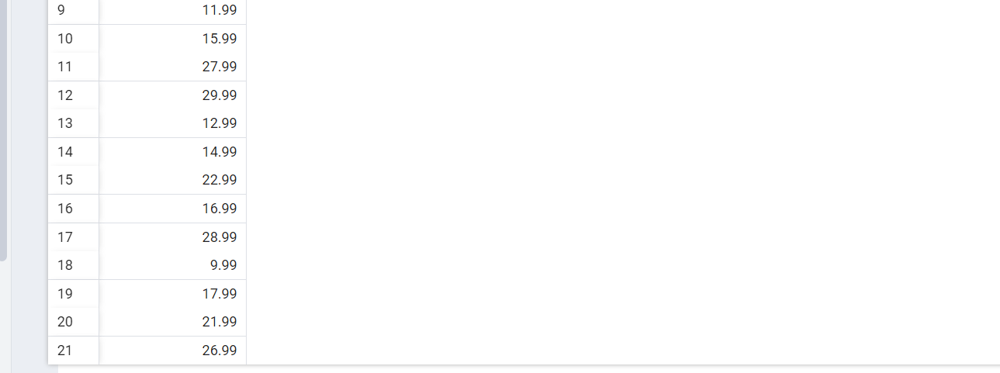
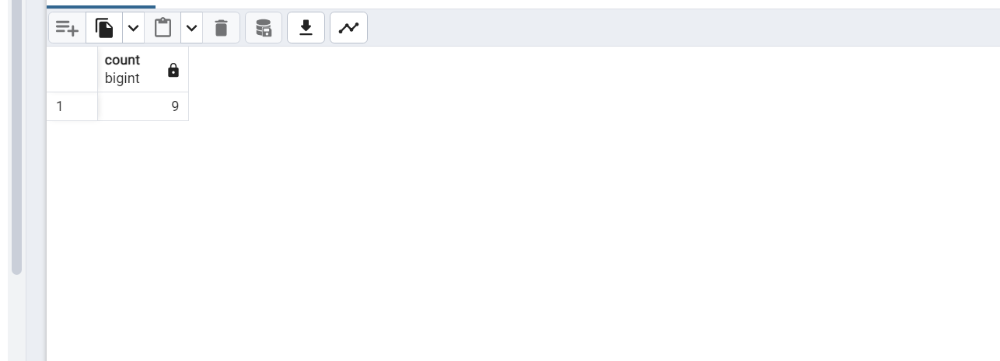
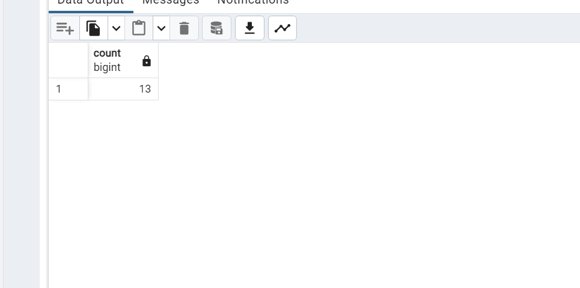
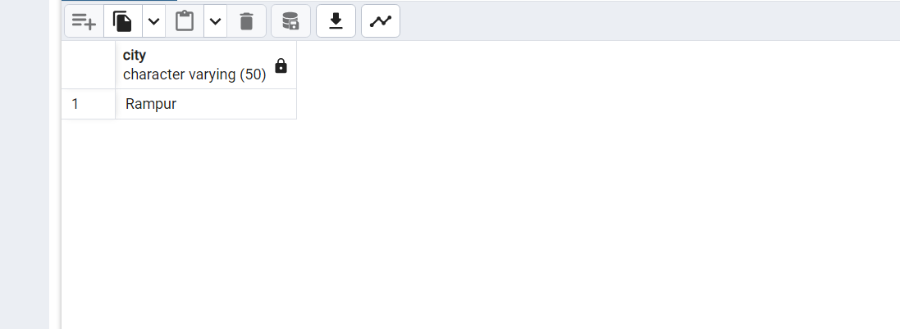

1 - film tablosunda bulunan replacement_cost sütununda bulunan birbirinden farklı değerleri sıralayınız.

  <h2> SELECT DISTINCT replacement_cost FROM film ; </h2>

-----------------------
2 - film tablosunda bulunan replacement_cost sütununda birbirinden farklı kaç tane veri vardır?

 <H2> SELECT COUNT (DISTINCT replacement_cost) FROM film ; </H2>

----------------------

3 - film tablosunda bulunan film isimlerinde (title) kaç tanesini T karakteri ile başlar ve aynı zamanda rating 'G' ye eşittir?

<H2>SELECT COUNT(*) FROM film  
WHERE title  LIKE 'T%' AND rating ='G';
</H2>

---------------------

4 - country tablosunda bulunan ülke isimlerinden (country) kaç tanesi 5 karakterden oluşmaktadır?

<H2> SELECT COUNT(*) FROM country  
WHERE country  LIKE '_____' ; </H2>

--------------------------

5 - city tablosundaki şehir isimlerinin kaç tanesi 'R' veya r karakteri ile biter?

<h2> SELECT city FROM city   
WHERE city  ILIKE 'r%r' ; </h2>

