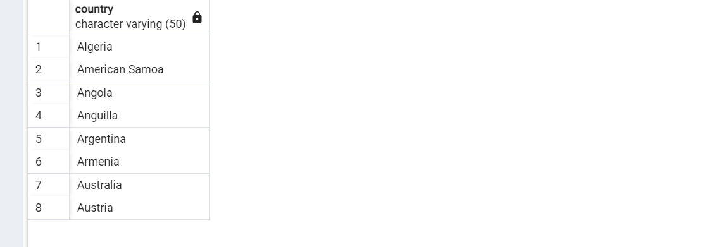
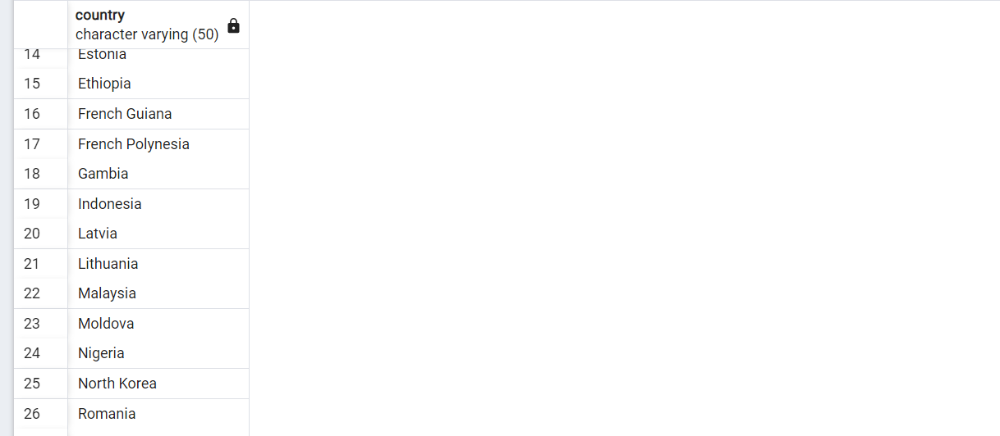
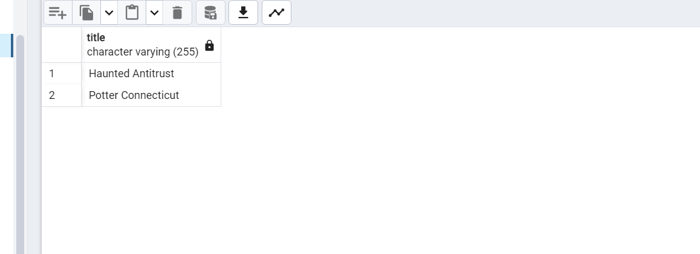
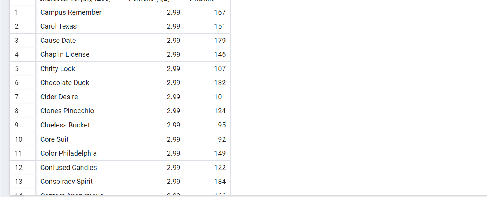

1 - country tablosunda bulunan country sütunundaki ülke isimlerinden 'A' karakteri ile başlayıp 'a' karakteri ile sonlananları sıralayınız.

<h2>SELECT country FROM country  
WHERE country LIKE 'A%a' ; </h2>

--------------

2 - country tablosunda bulunan country sütunundaki ülke isimlerinden en az 6 karakterden oluşan ve sonu 'n' karakteri ile sonlananları sıralayınız.

<h2>SELECT country FROM country  
WHERE country LIKE '%_____a' ;</h2>

-------------------

3 - film tablosunda bulunan title sütunundaki film isimlerinden en az 4 adet büyük ya da küçük harf farketmesizin 'T' karakteri içeren film isimlerini sıralayınız.

<h2>SELECT title FROM film  
WHERE title ILIKE '%t%t%t%t' ; </h2>

--------------------

4 - film tablosunda bulunan tüm sütunlardaki verilerden title 'C' karakteri ile başlayan ve uzunluğu (length) 90 dan büyük olan ve rental_rate 2.99 olan verileri sıralayınız.

<h2> SELECT title,rental_rate,length FROM film  
WHERE title LIKE 'C%' AND length > 90 AND rental_rate= 2.99 ; </h2>

